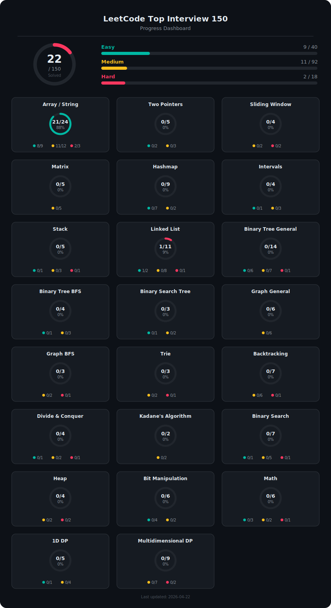

# PythonDSAProblemSolutions

My Data structure and Algorithm Problem Solutions in Python

<div align="center">
  
</div>

## Content table

```
.
|-- 01_Array___String
|-- 02_Two_Pointers
|-- 03_Sliding_Window
|-- 04_Matrix
|-- 05_Hashmap
|-- 06_Intervals
|-- 07_Stack
|-- 08_Linked_List
|-- 09_Binary_Tree_General
|-- 10_Binary_Tree_BFS
|-- 11_Binary_Search_Tree
|-- 12_Graph_General
|-- 13_Graph_BFS
|-- 14_Trie
|-- 15_Backtracking
|-- 16_Divide_&_Conquer
|-- 17_Kadane's_Algorithm
|-- 18_Binary_Search
|-- 19_Heap
|-- 20_Bit_Manipulation
|-- 21_Math
|-- 22_1D_DP
`-- 23_Multidimensional_DP
```
